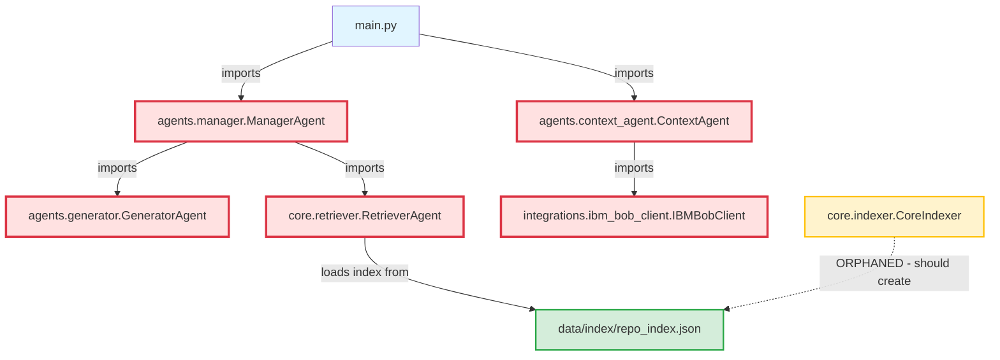

# Architectural Audit Report: ArcSync Multi-Agent Orchestration
**Date**: 2026-05-01  
**Auditor**: Bob (Plan Mode)  
**Scope**: Import chain analysis, path verification, and architectural integrity

---

## Executive Summary

**CRITICAL FINDING**: The Multi-Agent Orchestration system has **BROKEN IMPORTS** that will prevent it from functioning. All three package directories (`agents/`, `core/`, `integrations/`) are **missing `__init__.py` files**, making them non-importable as Python packages.

**Status**: 🔴 **SYSTEM WILL NOT RUN**

---

## 1. Import Chain Analysis

### 1.1 Entry Point: [`main.py`](main.py:1)

```python
import streamlit as st
from agents.manager import ManagerAgent
from agents.context_agent import ContextAgent
```

**Status**: ❌ **BROKEN**  
**Reason**: `agents/` directory lacks `__init__.py`, making it non-importable as a package.

---

### 1.2 Agent Layer: [`agents/manager.py`](agents/manager.py:1)

```python
from agents.generator import GeneratorAgent
from core.retriever import RetrieverAgent
```

**Issues Identified**:
1. ❌ **Import from `agents.generator`**: Broken (no `__init__.py` in `agents/`)
2. ❌ **Import from `core.retriever`**: Broken (no `__init__.py` in `core/`)
3. ⚠️ **Class name mismatch**: Imports `RetrieverAgent` but [`core/retriever.py`](core/retriever.py:4) defines `RetrieverAgent` (correct)

**Expected Classes**:
- [`GeneratorAgent`](agents/generator.py:3) ✅ Exists
- [`RetrieverAgent`](core/retriever.py:4) ✅ Exists

---

### 1.3 Agent Layer: [`agents/context_agent.py`](agents/context_agent.py:1)

```python
from integrations.ibm_bob_client import IBMBobClient
```

**Status**: ❌ **BROKEN**  
**Reason**: `integrations/` directory lacks `__init__.py`

**Expected Class**: [`IBMBobClient`](integrations/ibm_bob_client.py:5) ✅ Exists

---

### 1.4 Core Layer: [`core/retriever.py`](core/retriever.py:1)

```python
import json
from pathlib import Path
```

**Status**: ✅ **VALID** (standard library imports only)

**Class Defined**: [`RetrieverAgent`](core/retriever.py:4)

---

### 1.5 Core Layer: [`core/indexer.py`](core/indexer.py:1)

```python
import json
from pathlib import Path
```

**Status**: ✅ **VALID** (standard library imports only)

**Class Defined**: [`CoreIndexer`](core/indexer.py:4)  
**Note**: ⚠️ This class is **NEVER IMPORTED** anywhere in the codebase (orphaned component)

---

### 1.6 Integration Layer: [`integrations/ibm_bob_client.py`](integrations/ibm_bob_client.py:1)

```python
import json
import datetime
from pathlib import Path
```

**Status**: ✅ **VALID** (standard library imports only)

**Class Defined**: [`IBMBobClient`](integrations/ibm_bob_client.py:5)

---

## 2. Missing Package Initialization Files

### Critical Issue: No `__init__.py` Files

Python requires `__init__.py` files in directories to treat them as packages. **ALL THREE** package directories are missing this file:

| Directory | Status | Impact |
|-----------|--------|--------|
| `agents/` | ❌ Missing `__init__.py` | Cannot import `ManagerAgent`, `ContextAgent`, `GeneratorAgent` |
| `core/` | ❌ Missing `__init__.py` | Cannot import `RetrieverAgent`, `CoreIndexer` |
| `integrations/` | ❌ Missing `__init__.py` | Cannot import `IBMBobClient` |

**Result**: Running [`main.py`](main.py:2) will immediately fail with:
```
ModuleNotFoundError: No module named 'agents'
```

---

## 3. Class Definition Verification

### 3.1 Expected vs Actual Classes

| Import Statement | Expected Class | Actual Class | File | Status |
|-----------------|----------------|--------------|------|--------|
| `from agents.manager import ManagerAgent` | `ManagerAgent` | [`ManagerAgent`](agents/manager.py:4) | `agents/manager.py` | ✅ Match |
| `from agents.context_agent import ContextAgent` | `ContextAgent` | [`ContextAgent`](agents/context_agent.py:3) | `agents/context_agent.py` | ✅ Match |
| `from agents.generator import GeneratorAgent` | `GeneratorAgent` | [`GeneratorAgent`](agents/generator.py:3) | `agents/generator.py` | ✅ Match |
| `from core.retriever import RetrieverAgent` | `RetrieverAgent` | [`RetrieverAgent`](core/retriever.py:4) | `core/retriever.py` | ✅ Match |
| `from integrations.ibm_bob_client import IBMBobClient` | `IBMBobClient` | [`IBMBobClient`](integrations/ibm_bob_client.py:5) | `integrations/ibm_bob_client.py` | ✅ Match |

**Conclusion**: All class names match their import expectations. No naming mismatches detected.

---

## 4. Orphaned Components

### 4.1 [`CoreIndexer`](core/indexer.py:4) - Unused Class

**Location**: [`core/indexer.py`](core/indexer.py:4)  
**Status**: ⚠️ **ORPHANED** - Never imported or used

**Analysis**:
- Designed to transform IBM Bob metadata into searchable index
- Implements FR2 (Repository Context Injection)
- Has methods: `index_repository()`, `_save_index()`
- **Problem**: [`RetrieverAgent`](core/retriever.py:4) loads index directly from JSON, bypassing `CoreIndexer`

**Impact**: 
- No way to create the index that `RetrieverAgent` depends on
- Missing integration between IBM Bob metadata and the retrieval system
- Potential architectural gap in the indexing pipeline

---

## 5. Dependency Flow Diagram



**Legend**:
- 🔴 Red: Broken imports (missing `__init__.py`)
- 🟡 Yellow: Orphaned component (never used)
- 🟢 Green: Working component

---

## 6. Path Verification Summary

### 6.1 File Paths - All Valid ✅

| Import Path | Actual File Path | Status |
|------------|------------------|--------|
| `agents/manager.py` | `agents/manager.py` | ✅ Exists |
| `agents/context_agent.py` | `agents/context_agent.py` | ✅ Exists |
| `agents/generator.py` | `agents/generator.py` | ✅ Exists |
| `core/retriever.py` | `core/retriever.py` | ✅ Exists |
| `core/indexer.py` | `core/indexer.py` | ✅ Exists |
| `integrations/ibm_bob_client.py` | `integrations/ibm_bob_client.py` | ✅ Exists |

**Conclusion**: All file paths are correct. No missing files or path mismatches.

---

## 7. Critical Issues Summary

### 7.1 Blocking Issues (Must Fix)

1. **Missing `agents/__init__.py`** 🔴 CRITICAL
   - **Impact**: Cannot import any agent classes
   - **Affects**: [`main.py`](main.py:2), [`agents/manager.py`](agents/manager.py:1)
   - **Fix**: Create empty `__init__.py` file

2. **Missing `core/__init__.py`** 🔴 CRITICAL
   - **Impact**: Cannot import `RetrieverAgent`
   - **Affects**: [`agents/manager.py`](agents/manager.py:2)
   - **Fix**: Create empty `__init__.py` file

3. **Missing `integrations/__init__.py`** 🔴 CRITICAL
   - **Impact**: Cannot import `IBMBobClient`
   - **Affects**: [`agents/context_agent.py`](agents/context_agent.py:1)
   - **Fix**: Create empty `__init__.py` file

### 7.2 Architectural Issues (Should Fix)

4. **Orphaned `CoreIndexer` class** 🟡 WARNING
   - **Impact**: No way to create the index that `RetrieverAgent` needs
   - **Location**: [`core/indexer.py`](core/indexer.py:4)
   - **Fix**: Integrate `CoreIndexer` into the workflow or document manual index creation

5. **Missing index creation workflow** 🟡 WARNING
   - **Impact**: [`RetrieverAgent`](core/retriever.py:9) expects `data/index/repo_index.json` but nothing creates it
   - **Fix**: Add initialization step that uses `CoreIndexer` to build index from IBM Bob metadata

---

## 8. Recommendations

### 8.1 Immediate Actions (Required for System to Run)

1. **Create `agents/__init__.py`**
   ```python
   # agents/__init__.py
   from .manager import ManagerAgent
   from .context_agent import ContextAgent
   from .generator import GeneratorAgent
   
   __all__ = ['ManagerAgent', 'ContextAgent', 'GeneratorAgent']
   ```

2. **Create `core/__init__.py`**
   ```python
   # core/__init__.py
   from .retriever import RetrieverAgent
   from .indexer import CoreIndexer
   
   __all__ = ['RetrieverAgent', 'CoreIndexer']
   ```

3. **Create `integrations/__init__.py`**
   ```python
   # integrations/__init__.py
   from .ibm_bob_client import IBMBobClient
   
   __all__ = ['IBMBobClient']
   ```

### 8.2 Architectural Improvements

4. **Integrate `CoreIndexer` into workflow**
   - Add initialization step in [`main.py`](main.py:8) or create setup script
   - Use `CoreIndexer` to build index from IBM Bob metadata before retrieval

5. **Add index initialization check**
   - Modify [`RetrieverAgent.__init__()`](core/retriever.py:9) to create index if missing
   - Or add explicit setup step in application startup

6. **Document index creation process**
   - Add README section explaining how to initialize the system
   - Include example of running `CoreIndexer` to build initial index

---

## 9. Testing Recommendations

After fixing `__init__.py` files, test the import chain:

```python
# test_imports.py
try:
    from agents.manager import ManagerAgent
    from agents.context_agent import ContextAgent
    from agents.generator import GeneratorAgent
    from core.retriever import RetrieverAgent
    from core.indexer import CoreIndexer
    from integrations.ibm_bob_client import IBMBobClient
    print("✅ All imports successful")
except ImportError as e:
    print(f"❌ Import failed: {e}")
```

---

## 10. Conclusion

**Current State**: 🔴 **SYSTEM CANNOT RUN**

The Multi-Agent Orchestration system has a **fundamental packaging issue** that prevents all imports from working. While the file structure, class names, and import paths are all correct, the absence of `__init__.py` files in all three package directories makes them non-importable.

**Severity**: CRITICAL - System will fail immediately on startup

**Effort to Fix**: LOW - Creating three empty `__init__.py` files will resolve all blocking issues

**Additional Work**: MEDIUM - Integrating the orphaned `CoreIndexer` requires architectural decisions about index initialization workflow

---

## Appendix: Complete Import Graph

```
main.py
├── agents.manager.ManagerAgent ❌
│   ├── agents.generator.GeneratorAgent ❌
│   └── core.retriever.RetrieverAgent ❌
└── agents.context_agent.ContextAgent ❌
    └── integrations.ibm_bob_client.IBMBobClient ❌

Orphaned:
└── core.indexer.CoreIndexer ⚠️ (never imported)
```

**Legend**: ❌ = Broken import | ⚠️ = Orphaned component