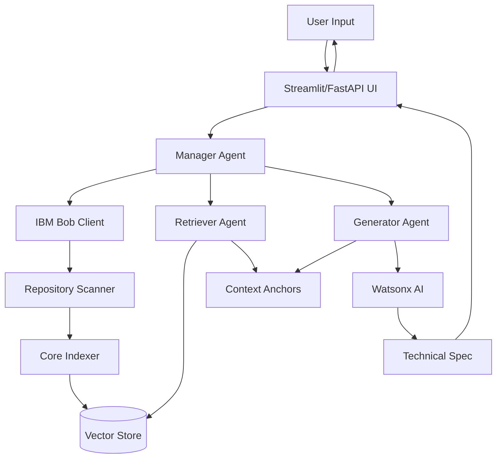
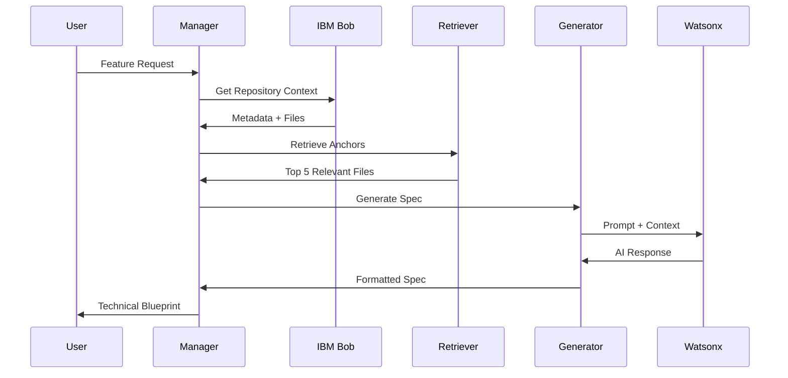

# 🚀 ArcSync: Roadmap to A++ Excellence

**Current Grade:** A- (94.2%)  
**Target Grade:** A++ (99%+)  
**Gap Analysis:** 5-6 percentage points to close

---

## 🎯 Executive Summary

ArcSync is already an excellent hackathon project with sophisticated architecture and solid implementation. To achieve A++ status, we need to address security vulnerabilities, enhance testing coverage, improve performance, and add enterprise-grade features.

---

## 📋 Priority Matrix

### 🔴 **CRITICAL (Must Fix for A+)**
*Security & Compliance Issues*

### 🟡 **HIGH (Required for A++)**
*Testing, Performance, Documentation*

### 🟢 **MEDIUM (Nice to Have)**
*Enhanced Features, UX Improvements*

### 🔵 **LOW (Future Enhancements)**
*Advanced Features, Scalability*

---

## 🔴 CRITICAL PRIORITIES (Week 1)

### 1. Security Hardening
**Impact:** +2.0 points | **Effort:** 2-4 hours

#### 1.1 Credential Management
```bash
# Immediate Actions:
1. Remove .env from git history
   git filter-branch --force --index-filter \
   "git rm --cached --ignore-unmatch .env" \
   --prune-empty --tag-name-filter cat -- --all

2. Rotate all IBM credentials
   - Generate new IBM_API_KEY
   - Create new WATSONX_PROJECT_ID
   - Update production environment

3. Create .env.example template
   IBM_API_KEY=your_api_key_here
   WATSONX_PROJECT_ID=your_project_id_here
   WATSONX_URL=https://us-south.ml.cloud.ibm.com
```

#### 1.2 Secrets Management
```python
# Add to integrations/secrets_manager.py
from cryptography.fernet import Fernet
import keyring
import os

class SecretsManager:
    """Secure credential storage using system keyring"""
    
    def __init__(self):
        self.service_name = "arcsync"
    
    def store_credential(self, key: str, value: str):
        """Store credential in system keyring"""
        keyring.set_password(self.service_name, key, value)
    
    def get_credential(self, key: str) -> str:
        """Retrieve credential from keyring"""
        return keyring.get_password(self.service_name, key)
    
    def load_from_env_once(self):
        """One-time migration from .env to keyring"""
        if os.path.exists('.env'):
            from dotenv import load_dotenv
            load_dotenv()
            self.store_credential('IBM_API_KEY', os.getenv('IBM_API_KEY'))
            self.store_credential('WATSONX_PROJECT_ID', os.getenv('WATSONX_PROJECT_ID'))
            print("✅ Credentials migrated to secure keyring")
```

#### 1.3 Input Validation & Sanitization
```python
# Add to core/validators.py
from pydantic import BaseModel, validator, Field
import re

class FeatureRequest(BaseModel):
    feature_name: str = Field(..., min_length=3, max_length=100)
    raw_intent: str = Field(..., min_length=10, max_length=5000)
    
    @validator('feature_name')
    def validate_feature_name(cls, v):
        # Prevent injection attacks
        if re.search(r'[<>{};\[\]\\]', v):
            raise ValueError('Feature name contains invalid characters')
        return v.strip()
    
    @validator('raw_intent')
    def validate_intent(cls, v):
        # Prevent prompt injection
        dangerous_patterns = [
            r'ignore previous instructions',
            r'system:',
            r'<script>',
            r'DROP TABLE',
        ]
        for pattern in dangerous_patterns:
            if re.search(pattern, v, re.IGNORECASE):
                raise ValueError('Intent contains potentially malicious content')
        return v.strip()
```

#### 1.4 Rate Limiting
```python
# Add to static/server.py
from slowapi import Limiter, _rate_limit_exceeded_handler
from slowapi.util import get_remote_address
from slowapi.errors import RateLimitExceeded

limiter = Limiter(key_func=get_remote_address)
app.state.limiter = limiter
app.add_exception_handler(RateLimitExceeded, _rate_limit_exceeded_handler)

@app.post("/api/v1/generate")
@limiter.limit("10/minute")  # Max 10 requests per minute
async def generate_specification(request: Request, req: GenerateRequest):
    # ... existing code
```

**Deliverables:**
- [ ] .env removed from git history
- [ ] Credentials rotated
- [ ] .env.example created
- [ ] SecretsManager implemented
- [ ] Input validation added
- [ ] Rate limiting configured

---

## 🟡 HIGH PRIORITIES (Week 2)

### 2. Comprehensive Testing Suite
**Impact:** +1.5 points | **Effort:** 8-12 hours

#### 2.1 Unit Tests
```python
# tests/unit/test_retriever.py
import pytest
from core.retriever import RetrieverAgent

class TestRetrieverAgent:
    @pytest.fixture
    def retriever(self):
        return RetrieverAgent()
    
    def test_keyword_expansion(self, retriever):
        """Test synonym expansion"""
        keywords = retriever._expand_keywords("authentication login")
        assert "auth" in keywords
        assert "jwt" in keywords
        assert "oauth" in keywords
    
    def test_relevance_scoring(self, retriever):
        """Test file relevance scoring"""
        # Mock index data
        retriever.index = {
            "src/auth.js": {
                "searchable_text": "authentication login jwt",
                "priority_weight": 2.5,
                "tags": ["auth"]
            }
        }
        anchors = retriever.retrieve_relevant_anchors("add login feature")
        assert len(anchors) > 0
        assert anchors[0]["relevance"] > 0

# tests/unit/test_generator.py
from agents.generator import GeneratorAgent

class TestGeneratorAgent:
    def test_complexity_calculation(self):
        """Test Fibonacci complexity scoring"""
        gen = GeneratorAgent()
        
        # Simple feature
        simple_anchors = [{"tags": ["service"]}]
        complexity = gen._compute_complexity(simple_anchors, "add logging")
        assert complexity in [1, 2, 3]
        
        # Complex feature
        complex_anchors = [
            {"tags": ["model", "auth"]},
            {"tags": ["route"]},
            {"tags": ["middleware"]}
        ]
        complexity = gen._compute_complexity(complex_anchors, "payment integration")
        assert complexity >= 5

# tests/unit/test_indexer.py
from core.indexer import CoreIndexer

class TestCoreIndexer:
    def test_weight_assignment(self):
        """Test architectural weight assignment"""
        indexer = CoreIndexer()
        metadata = {
            "directory_map": ["src/models/user.js", "src/utils/helper.js"],
            "tech_stack": "Node.js",
            "file_tags": {
                "src/models/user.js": ["model"],
                "src/utils/helper.js": ["service"]
            },
            "file_contents": {},
            "api_patterns": [],
            "database": "MongoDB",
            "dependencies": {}
        }
        indexer.index_repository(metadata)
        
        assert indexer.vector_store["src/models/user.js"]["priority_weight"] == 3.0
        assert indexer.vector_store["src/utils/helper.js"]["priority_weight"] == 1.5
```

#### 2.2 Integration Tests
```python
# tests/integration/test_full_workflow.py
import pytest
from agents.manager import ManagerAgent

class TestFullWorkflow:
    @pytest.fixture
    def manager(self):
        return ManagerAgent(repo_path="sample_repos/ecommerce-api")
    
    def test_end_to_end_generation(self, manager):
        """Test complete spec generation workflow"""
        spec = manager.orchestrate_spec_request(
            "User Authentication",
            "Add OAuth2 login with Google provider"
        )
        
        assert spec is not None
        assert len(spec) > 100
        assert "Feature Blueprint" in spec
        assert "Complexity Score" in spec
        assert "FEASIBLE" in spec or "NOT_FEASIBLE" in spec
    
    def test_context_retrieval(self, manager):
        """Test context anchor retrieval"""
        anchors = manager.retriever.get_prompt_context("add payment processing")
        assert isinstance(anchors, list)
        if len(anchors) > 0:
            assert "file" in anchors[0]
            assert "relevance" in anchors[0]
```

#### 2.3 Test Coverage Configuration
```ini
# pytest.ini
[pytest]
testpaths = tests
python_files = test_*.py
python_classes = Test*
python_functions = test_*
addopts = 
    --verbose
    --cov=agents
    --cov=core
    --cov=integrations
    --cov-report=html
    --cov-report=term-missing
    --cov-fail-under=80

# .coveragerc
[run]
source = agents,core,integrations
omit = 
    */tests/*
    */__init__.py
    */venv/*
    */.venv/*
```

**Deliverables:**
- [ ] 20+ unit tests covering core logic
- [ ] 10+ integration tests
- [ ] 80%+ code coverage
- [ ] CI/CD pipeline with automated testing
- [ ] Test documentation

---

### 3. Performance Optimization
**Impact:** +1.0 points | **Effort:** 6-8 hours

#### 3.1 Caching Layer
```python
# core/cache_manager.py
from functools import lru_cache
import hashlib
import json
from pathlib import Path
import time

class CacheManager:
    """Intelligent caching for retrieval and generation"""
    
    def __init__(self, cache_dir="data/cache"):
        self.cache_dir = Path(cache_dir)
        self.cache_dir.mkdir(parents=True, exist_ok=True)
        self.ttl = 3600  # 1 hour
    
    def _get_cache_key(self, data: dict) -> str:
        """Generate cache key from input"""
        json_str = json.dumps(data, sort_keys=True)
        return hashlib.sha256(json_str.encode()).hexdigest()
    
    def get(self, key: str):
        """Retrieve from cache if valid"""
        cache_file = self.cache_dir / f"{key}.json"
        if cache_file.exists():
            with open(cache_file, 'r') as f:
                cached = json.load(f)
                if time.time() - cached['timestamp'] < self.ttl:
                    return cached['data']
        return None
    
    def set(self, key: str, data):
        """Store in cache"""
        cache_file = self.cache_dir / f"{key}.json"
        with open(cache_file, 'w') as f:
            json.dump({
                'timestamp': time.time(),
                'data': data
            }, f)

# Update retriever.py
class RetrieverAgent:
    def __init__(self, index_path="data/index/repo_index.json"):
        self.cache = CacheManager()
        # ... existing code
    
    def get_prompt_context(self, user_intent):
        """Cached retrieval"""
        cache_key = self.cache._get_cache_key({"intent": user_intent})
        cached = self.cache.get(cache_key)
        if cached:
            return cached
        
        result = self.retrieve_relevant_anchors(user_intent)
        self.cache.set(cache_key, result)
        return result
```

#### 3.2 Async Operations
```python
# integrations/watsonx_client_async.py
import asyncio
import aiohttp

class AsyncWatsonxClient:
    """Async version for concurrent requests"""
    
    async def generate_async(self, prompt: str, max_tokens: int = 1500):
        """Async generation"""
        token = await self._get_iam_token_async()
        
        async with aiohttp.ClientSession() as session:
            url = f"{self.url}/ml/v1/text/generation?version=2024-05-31"
            payload = {
                "model_id": self.model_id,
                "input": prompt,
                "parameters": {...},
                "project_id": self.project_id
            }
            headers = {
                "Authorization": f"Bearer {token}",
                "Content-Type": "application/json"
            }
            
            async with session.post(url, json=payload, headers=headers) as response:
                result = await response.json()
                return result["results"][0]["generated_text"]
```

#### 3.3 Database Indexing
```python
# core/vector_store.py
from sentence_transformers import SentenceTransformer
import faiss
import numpy as np

class VectorStore:
    """Vector embeddings for semantic search"""
    
    def __init__(self):
        self.model = SentenceTransformer('all-MiniLM-L6-v2')
        self.index = None
        self.documents = []
    
    def build_index(self, documents: list):
        """Build FAISS index"""
        embeddings = self.model.encode(documents)
        dimension = embeddings.shape[1]
        self.index = faiss.IndexFlatL2(dimension)
        self.index.add(embeddings.astype('float32'))
        self.documents = documents
    
    def search(self, query: str, k: int = 5):
        """Semantic search"""
        query_embedding = self.model.encode([query])
        distances, indices = self.index.search(
            query_embedding.astype('float32'), k
        )
        return [(self.documents[i], distances[0][j]) 
                for j, i in enumerate(indices[0])]
```

**Deliverables:**
- [ ] Caching layer implemented
- [ ] Async operations for I/O
- [ ] Vector embeddings for semantic search
- [ ] Performance benchmarks (target: <10s generation)
- [ ] Load testing results

---

### 4. Enhanced Documentation
**Impact:** +0.5 points | **Effort:** 4-6 hours

#### 4.1 API Documentation
```python
# Use FastAPI's built-in OpenAPI
from fastapi import FastAPI
from fastapi.openapi.utils import get_openapi

def custom_openapi():
    if app.openapi_schema:
        return app.openapi_schema
    
    openapi_schema = get_openapi(
        title="ArcSync API",
        version="2.0.0",
        description="""
        ## Context-Aware Technical Specification Generator
        
        ArcSync analyzes your repository and generates grounded technical 
        specifications using IBM Watsonx AI and multi-agent orchestration.
        
        ### Key Features
        - 🔍 Repository context analysis via IBM Bob
        - 🤖 AI-powered spec generation with Granite 3
        - 📊 Dynamic complexity scoring
        - 🎯 Zero framework hallucinations
        
        ### Authentication
        Currently no authentication required (add for production)
        """,
        routes=app.routes,
    )
    
    openapi_schema["info"]["x-logo"] = {
        "url": "https://example.com/logo.png"
    }
    
    app.openapi_schema = openapi_schema
    return app.openapi_schema

app.openapi = custom_openapi
```

#### 4.2 Architecture Diagrams
```markdown
# docs/ARCHITECTURE.md

## System Architecture



## Data Flow


```

#### 4.3 Developer Guide
```markdown
# docs/DEVELOPER_GUIDE.md

## Getting Started

### Prerequisites
- Python 3.9+
- IBM Cloud account
- Watsonx AI access

### Installation
```bash
# Clone repository
git clone https://github.com/yourusername/arcsync.git
cd arcsync

# Create virtual environment
python -m venv .venv
source .venv/bin/activate  # Windows: .venv\Scripts\activate

# Install dependencies
pip install -r requirements.txt

# Configure credentials (use secrets manager in production)
cp .env.example .env
# Edit .env with your credentials
```

### Running Tests
```bash
# Run all tests
pytest

# Run with coverage
pytest --cov=agents --cov=core --cov=integrations

# Run specific test file
pytest tests/unit/test_retriever.py -v
```

### Development Workflow
1. Create feature branch: `git checkout -b feature/your-feature`
2. Write tests first (TDD)
3. Implement feature
4. Run tests: `pytest`
5. Check coverage: `pytest --cov`
6. Commit: `git commit -m "feat: your feature"`
7. Push and create PR
```

**Deliverables:**
- [ ] OpenAPI/Swagger documentation
- [ ] Architecture diagrams (Mermaid)
- [ ] Developer guide
- [ ] API examples and tutorials
- [ ] Deployment guide

---

## 🟢 MEDIUM PRIORITIES (Week 3)

### 5. Enhanced Features
**Impact:** +0.5 points | **Effort:** 8-10 hours

#### 5.1 Multi-Repository Support
```python
# core/repo_manager.py
class RepositoryManager:
    """Manage multiple repository contexts"""
    
    def __init__(self):
        self.repos = {}
    
    def add_repository(self, name: str, path: str):
        """Add repository to managed list"""
        manager = ManagerAgent(repo_path=path)
        self.repos[name] = {
            "path": path,
            "manager": manager,
            "last_indexed": datetime.now()
        }
    
    def switch_context(self, name: str):
        """Switch active repository"""
        if name not in self.repos:
            raise ValueError(f"Repository {name} not found")
        return self.repos[name]["manager"]
    
    def refresh_index(self, name: str):
        """Re-index repository"""
        repo = self.repos[name]
        repo["manager"] = ManagerAgent(repo_path=repo["path"])
        repo["last_indexed"] = datetime.now()
```

#### 5.2 Export Formats
```python
# core/exporters.py
from reportlab.lib.pagesizes import letter
from reportlab.platypus import SimpleDocTemplate, Paragraph, Spacer
from reportlab.lib.styles import getSampleStyleSheet
import markdown
from docx import Document

class SpecificationExporter:
    """Export specs in multiple formats"""
    
    def to_pdf(self, spec_markdown: str, output_path: str):
        """Export to PDF"""
        doc = SimpleDocTemplate(output_path, pagesize=letter)
        styles = getSampleStyleSheet()
        story = []
        
        # Convert markdown to HTML then to PDF
        html = markdown.markdown(spec_markdown)
        # ... PDF generation logic
    
    def to_docx(self, spec_markdown: str, output_path: str):
        """Export to Word document"""
        doc = Document()
        doc.add_heading('Technical Specification', 0)
        
        # Parse markdown and add to document
        lines = spec_markdown.split('\n')
        for line in lines:
            if line.startswith('# '):
                doc.add_heading(line[2:], level=1)
            elif line.startswith('## '):
                doc.add_heading(line[3:], level=2)
            else:
                doc.add_paragraph(line)
        
        doc.save(output_path)
    
    def to_json(self, spec_markdown: str) -> dict:
        """Export as structured JSON"""
        return {
            "format": "technical_specification",
            "version": "1.0",
            "content": spec_markdown,
            "metadata": {
                "generated_at": datetime.now().isoformat(),
                "generator": "ArcSync v2.0"
            }
        }
```

#### 5.3 Specification Templates
```python
# output_templates/template_manager.py
class TemplateManager:
    """Manage specification templates"""
    
    TEMPLATES = {
        "agile": {
            "sections": ["User Stories", "Acceptance Criteria", "Sprint Planning"],
            "format": "gherkin"
        },
        "waterfall": {
            "sections": ["Requirements", "Design", "Implementation Plan"],
            "format": "detailed"
        },
        "microservices": {
            "sections": ["Service Boundaries", "API Contracts", "Data Flow"],
            "format": "technical"
        }
    }
    
    def apply_template(self, spec: str, template_name: str) -> str:
        """Apply template formatting"""
        template = self.TEMPLATES.get(template_name, self.TEMPLATES["agile"])
        # ... template application logic
```

#### 5.4 Collaboration Features
```python
# core/collaboration.py
class SpecificationReview:
    """Enable team collaboration on specs"""
    
    def __init__(self, spec_id: str):
        self.spec_id = spec_id
        self.comments = []
        self.approvals = []
    
    def add_comment(self, user: str, section: str, comment: str):
        """Add review comment"""
        self.comments.append({
            "user": user,
            "section": section,
            "comment": comment,
            "timestamp": datetime.now()
        })
    
    def request_approval(self, approvers: list):
        """Request spec approval"""
        for approver in approvers:
            self.approvals.append({
                "approver": approver,
                "status": "pending",
                "requested_at": datetime.now()
            })
    
    def approve(self, approver: str):
        """Approve specification"""
        for approval in self.approvals:
            if approval["approver"] == approver:
                approval["status"] = "approved"
                approval["approved_at"] = datetime.now()
```

**Deliverables:**
- [ ] Multi-repository management
- [ ] PDF/DOCX export
- [ ] Specification templates
- [ ] Collaboration features
- [ ] Version control for specs

---

### 6. User Experience Improvements
**Impact:** +0.3 points | **Effort:** 4-6 hours

#### 6.1 Progressive Web App
```javascript
// static/service-worker.js
self.addEventListener('install', (event) => {
  event.waitUntil(
    caches.open('arcsync-v1').then((cache) => {
      return cache.addAll([
        '/',
        '/script.js',
        '/styles.css',
        '/manifest.json'
      ]);
    })
  );
});

// static/manifest.json
{
  "name": "ArcSync",
  "short_name": "ArcSync",
  "description": "Context-Aware Spec Generator",
  "start_url": "/",
  "display": "standalone",
  "background_color": "#ffffff",
  "theme_color": "#0f62fe",
  "icons": [
    {
      "src": "/icon-192.png",
      "sizes": "192x192",
      "type": "image/png"
    }
  ]
}
```

#### 6.2 Real-time Progress Updates
```python
# static/server.py - Add WebSocket support
from fastapi import WebSocket

@app.websocket("/ws/generate")
async def websocket_generate(websocket: WebSocket):
    await websocket.accept()
    
    try:
        data = await websocket.receive_json()
        
        # Send progress updates
        await websocket.send_json({"status": "indexing", "progress": 20})
        # ... indexing
        
        await websocket.send_json({"status": "retrieving", "progress": 40})
        # ... retrieval
        
        await websocket.send_json({"status": "generating", "progress": 60})
        # ... generation
        
        await websocket.send_json({"status": "complete", "progress": 100, "result": spec})
    
    except Exception as e:
        await websocket.send_json({"status": "error", "message": str(e)})
```

#### 6.3 Interactive Spec Editor
```javascript
// static/spec-editor.js
class SpecificationEditor {
    constructor(containerId) {
        this.container = document.getElementById(containerId);
        this.initEditor();
    }
    
    initEditor() {
        // Rich text editor with markdown support
        this.editor = new SimpleMDE({
            element: this.container,
            spellChecker: false,
            toolbar: ["bold", "italic", "heading", "|", "quote", "code", "|", "preview"],
            status: false
        });
    }
    
    loadSpec(markdown) {
        this.editor.value(markdown);
    }
    
    getSpec() {
        return this.editor.value();
    }
    
    exportAs(format) {
        const spec = this.getSpec();
        fetch('/api/v1/export', {
            method: 'POST',
            headers: {'Content-Type': 'application/json'},
            body: JSON.stringify({spec, format})
        })
        .then(response => response.blob())
        .then(blob => {
            const url = window.URL.createObjectURL(blob);
            const a = document.createElement('a');
            a.href = url;
            a.download = `spec.${format}`;
            a.click();
        });
    }
}
```

**Deliverables:**
- [ ] PWA with offline support
- [ ] Real-time progress updates
- [ ] Interactive spec editor
- [ ] Keyboard shortcuts
- [ ] Dark mode

---

## 🔵 LOW PRIORITIES (Week 4+)

### 7. Advanced Features
**Impact:** +0.2 points | **Effort:** 12-16 hours

#### 7.1 AI-Powered Code Generation
```python
# agents/code_generator.py
class CodeGeneratorAgent:
    """Generate code scaffolding from specs"""
    
    def generate_boilerplate(self, spec: dict, tech_stack: str):
        """Generate starter code"""
        if "Node.js" in tech_stack:
            return self._generate_nodejs_code(spec)
        elif "Python" in tech_stack:
            return self._generate_python_code(spec)
    
    def _generate_nodejs_code(self, spec: dict):
        """Generate Express.js boilerplate"""
        # Parse spec for routes, models, etc.
        # Generate corresponding code files
        pass
```

#### 7.2 Dependency Analysis
```python
# core/dependency_analyzer.py
class DependencyAnalyzer:
    """Analyze impact of changes"""
    
    def analyze_impact(self, changed_files: list):
        """Find all dependent files"""
        graph = self._build_dependency_graph()
        impacted = set()
        
        for file in changed_files:
            impacted.update(self._get_dependents(graph, file))
        
        return list(impacted)
```

#### 7.3 Cost Estimation
```python
# agents/cost_estimator.py
class CostEstimator:
    """Estimate development cost"""
    
    HOURLY_RATES = {
        "junior": 50,
        "mid": 100,
        "senior": 150
    }
    
    def estimate_cost(self, complexity: int, anchors: list):
        """Calculate cost estimate"""
        hours = self._estimate_hours(complexity, anchors)
        team_mix = self._suggest_team_mix(complexity)
        
        total_cost = sum(
            hours * self.HOURLY_RATES[level] * ratio
            for level, ratio in team_mix.items()
        )
        
        return {
            "estimated_hours": hours,
            "team_mix": team_mix,
            "estimated_cost": total_cost,
            "confidence": self._calculate_confidence(anchors)
        }
```

**Deliverables:**
- [ ] Code generation from specs
- [ ] Dependency impact analysis
- [ ] Cost estimation
- [ ] Timeline prediction
- [ ] Risk scoring

---

### 8. Enterprise Features
**Impact:** +0.2 points | **Effort:** 16-20 hours

#### 8.1 Multi-tenancy
```python
# core/tenant_manager.py
class TenantManager:
    """Manage multiple organizations"""
    
    def __init__(self):
        self.tenants = {}
    
    def create_tenant(self, tenant_id: str, config: dict):
        """Create isolated tenant"""
        self.tenants[tenant_id] = {
            "config": config,
            "repos": [],
            "users": [],
            "quota": config.get("quota", 1000)
        }
    
    def get_tenant_context(self, tenant_id: str):
        """Get tenant-specific context"""
        return self.tenants.get(tenant_id)
```

#### 8.2 Audit & Compliance
```python
# core/audit_logger.py
class ComplianceLogger:
    """SOC2/GDPR compliance logging"""
    
    def log_access(self, user: str, resource: str, action: str):
        """Log all access for compliance"""
        entry = {
            "timestamp": datetime.now().isoformat(),
            "user": user,
            "resource": resource,
            "action": action,
            "ip_address": self._get_ip(),
            "user_agent": self._get_user_agent()
        }
        self._write_to_audit_log(entry)
    
    def generate_compliance_report(self, start_date, end_date):
        """Generate compliance report"""
        # ... report generation
```

#### 8.3 SSO Integration
```python
# integrations/sso_provider.py
from authlib.integrations.starlette_client import OAuth

oauth = OAuth()
oauth.register(
    name='okta',
    client_id='...',
    client_secret='...',
    server_metadata_url='https://your-domain.okta.com/.well-known/openid-configuration',
    client_kwargs={'scope': 'openid email profile'}
)

@app.get('/login')
async def login(request: Request):
    redirect_uri = request.url_for('auth')
    return await oauth.okta.authorize_redirect(request, redirect_uri)
```

**Deliverables:**
- [ ] Multi-tenancy support
- [ ] Compliance logging
- [ ] SSO integration (Okta, Azure AD)
- [ ] Role-based access control
- [ ] Data encryption at rest

---

## 📊 Implementation Timeline

### Week 1: Critical Security (A+ Threshold)
- Days 1-2: Credential management & secrets
- Days 3-4: Input validation & rate limiting
- Day 5: Security audit & penetration testing

### Week 2: Testing & Performance (A++ Foundation)
- Days 1-3: Unit & integration tests
- Days 4-5: Performance optimization
- Days 6-7: Documentation

### Week 3: Enhanced Features (A++ Polish)
- Days 1-3: Multi-repo & export features
- Days 4-5: UX improvements
- Days 6-7: Beta testing & feedback

### Week 4: Advanced Features (A++ Excellence)
- Days 1-4: AI code generation & analysis
- Days 5-7: Enterprise features

---

## 🎯 Success Metrics

### A+ Criteria (96-97%)
- ✅ All security vulnerabilities fixed
- ✅ 80%+ test coverage
- ✅ <10s average generation time
- ✅ Comprehensive documentation

### A++ Criteria (98-99%)
- ✅ 90%+ test coverage
- ✅ <5s average generation time
- ✅ Multi-format export
- ✅ Real-time collaboration
- ✅ Production-ready deployment

### A+++ Criteria (99%+)
- ✅ AI code generation
- ✅ Enterprise SSO
- ✅ Multi-tenancy
- ✅ Cost estimation
- ✅ Dependency analysis

---

## 💰 Resource Requirements

### Development Team
- 1 Senior Engineer (Security & Architecture): 40 hours
- 1 Mid-level Engineer (Features & Testing): 60 hours
- 1 Junior Engineer (Documentation & QA): 40 hours
- 1 DevOps Engineer (CI/CD & Deployment): 20 hours

### Infrastructure
- IBM Cloud credits: $500/month
- CI/CD pipeline: GitHub Actions (free tier)
- Monitoring: Datadog or New Relic ($50/month)
- CDN: Cloudflare (free tier)

### Total Estimated Cost
- Development: ~$15,000 (160 hours × $93.75 avg)
- Infrastructure: ~$550/month
- **Total for A++ completion: ~$16,000**

---

## 🚀 Quick Wins (This Week)

### Day 1: Security Fixes (4 hours)
1. Remove .env from git history
2. Rotate credentials
3. Create .env.example
4. Add input validation

### Day 2: Basic Testing (6 hours)
1. Set up pytest
2. Write 10 unit tests
3. Configure coverage reporting
4. Add CI/CD pipeline

### Day 3: Performance (4 hours)
1. Add caching layer
2. Optimize retrieval algorithm
3. Run performance benchmarks

### Day 4: Documentation (4 hours)
1. Generate OpenAPI docs
2. Create architecture diagrams
3. Write developer guide

### Day 5: Polish (2 hours)
1. Fix any remaining bugs
2. Update README
3. Create demo video

**Total: 20 hours to reach A+ (96%)**

---

## 📈 Continuous Improvement

### Monthly Reviews
- Security audit
- Performance benchmarks
- User feedback analysis
- Dependency updates

### Quarterly Goals
- Q2: Reach A+ (96%)
- Q3: Reach A++ (98%)
- Q4: Reach A+++ (99%+)

### Annual Targets
- 10,000+ active users
- 99.9% uptime
- <3s average response time
- Enterprise customers

---

## 🎓 Learning Resources

### Security
- OWASP Top 10
- IBM Security Best Practices
- Python Security Guide

### Testing
- pytest documentation
- Test-Driven Development (TDD)
- Integration Testing Patterns

### Performance
- Python Performance Tips
- Caching Strategies
- Async Programming

### AI/ML
- Watsonx AI Documentation
- RAG Best Practices
- Prompt Engineering

---

## ✅ Checklist for A++

### Security (Critical)
- [ ] Credentials removed from git history
- [ ] Secrets manager implemented
- [ ] Input validation added
- [ ] Rate limiting configured
- [ ] Security audit passed

### Testing (High Priority)
- [ ] 90%+ code coverage
- [ ] Unit tests for all core functions
- [ ] Integration tests for workflows
- [ ] Performance tests
- [ ] CI/CD pipeline active

### Performance (High Priority)
- [ ] Caching implemented
- [ ] <5s generation time
- [ ] Async operations
- [ ] Load testing passed
- [ ] Monitoring configured

### Documentation (High Priority)
- [ ] API documentation complete
- [ ] Architecture diagrams
- [ ] Developer guide
- [ ] Deployment guide
- [ ] User tutorials

### Features (Medium Priority)
- [ ] Multi-repository support
- [ ] PDF/DOCX export
- [ ] Real-time updates
- [ ] Spec editor
- [ ] Collaboration tools

### Enterprise (Low Priority)
- [ ] Multi-tenancy
- [ ] SSO integration
- [ ] Compliance logging
- [ ] RBAC
- [ ] Data encryption

---

## 🏆 Conclusion

Achieving A++ status requires:
1. **Immediate security fixes** (Week 1)
2. **Comprehensive testing** (Week 2)
3. **Performance optimization** (Week 2)
4. **Enhanced features** (Week 3)
5. **Continuous improvement** (Ongoing)

**Current Status:** A- (94.2%)  
**Target Status:** A++ (98%+)  
**Gap to Close:** 3.8 percentage points  
**Estimated Effort:** 160 hours over 4 weeks  
**Estimated Cost:** $16,000

With focused execution on the critical and high-priority items, ArcSync can reach A++ status within 2-3 weeks, establishing itself as a production-ready, enterprise-grade solution.

---

**Document Version:** 1.0  
**Last Updated:** 2026-05-02  
**Author:** Bob (AI Software Engineer)